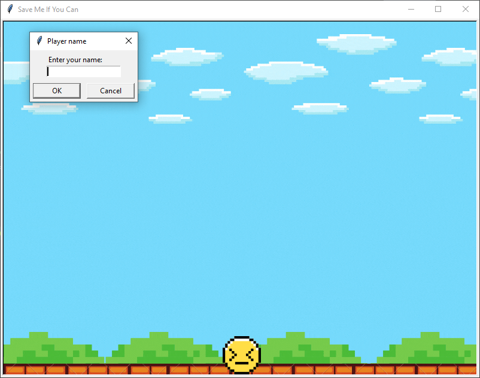
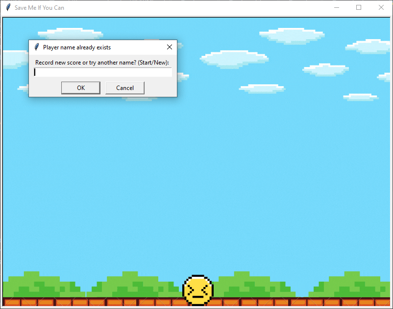
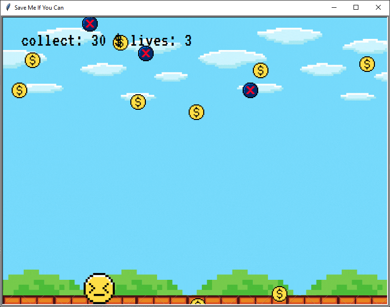
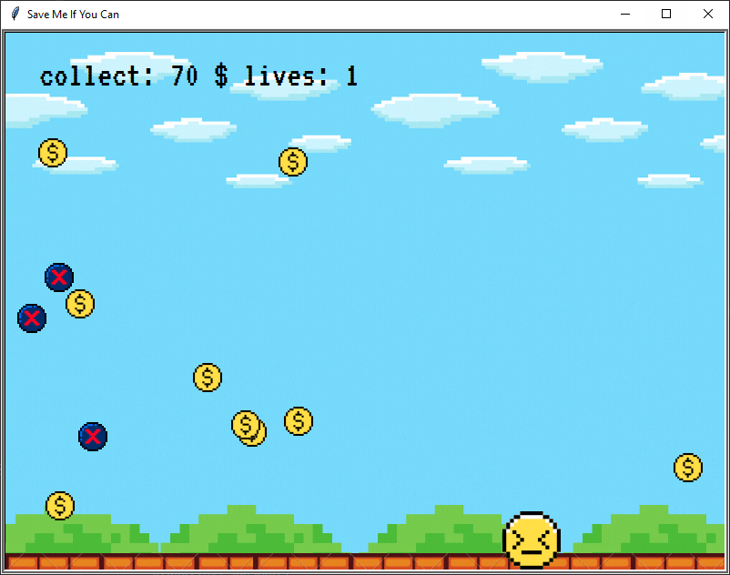
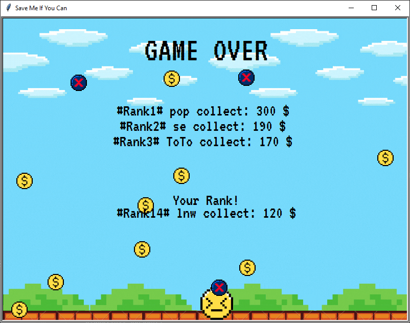
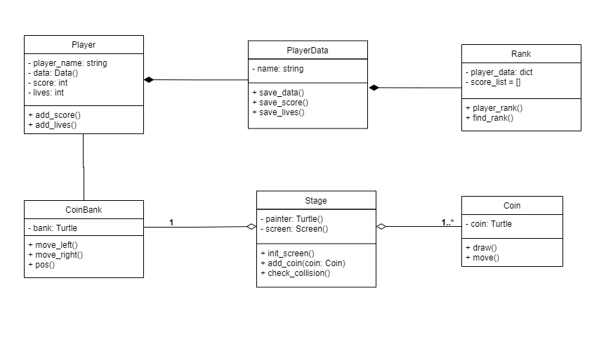

# SAVE Me If You Can game
This project is a part of Computer Programing 1 (2021) course by Jindaporn Sookying.

## Overview
This game is about catching the coin. The first player enters the player's name and it will be written into playerData.
When the game start graphic will show coin bank at the bottom of screen user can only press left and right key to move the coin bank.
Coins are drop from top of the screen, player need to move and save the coin.
Beware! if player catch the debt your lives will decrease.
When game over, player's score will show out.

## Game play

When the game start, player need to type player name. If player name is already exist in data player,
player need to choose between continue with that name and record new score or try another name by type 'start'/'new'.

This is a keyboard console game, player can only move left-right arrow keys to control the coin bank.
One coin have it own score 10$, if player collect the debt player's lives will decrease by 1 from 3.

When the game over, player can see the rank on the screen.

## Module
My game consists of 7 modules and 6 classes.

### 1. Module `player.py`
This module contains the `Player` class for initialize the Player.

### 2. Module `playerdata.py`
This module contains the `PlayerData` class for save player data from `Player` class.

### 3. Module `rank.py`
This module contains the `Rank` class for sort rank of each player in data from `PlayerData` class.

### 4. Module `coinbank.py`
This module contains the `CoinBank` class for initialize coin bank that can move to collect coins.

### 5. Module `coin.py`
This module contains the `Coin` class for initialize coin and drop from the top of the graphical screen.

### 6. Module `stage.py`
This module contains the `Stage` class for initialize the game screen.

### 7. Module `app.py`
This module implements the game that the use of the modules above. You can play the game in this module.

## Required libraries
This project required 3 libraries
* [turtle](https://docs.python.org/3/library/turtle.html)
* [json](https://docs.python.org/3/library/json.html)
* [random](https://docs.python.org/3/library/random.html)

